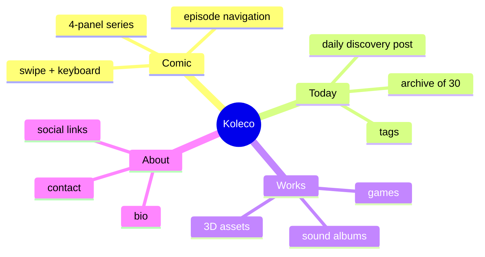
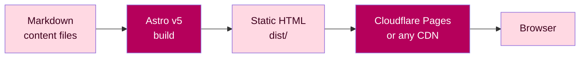
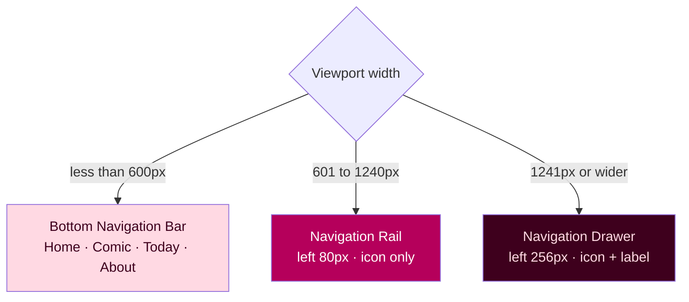
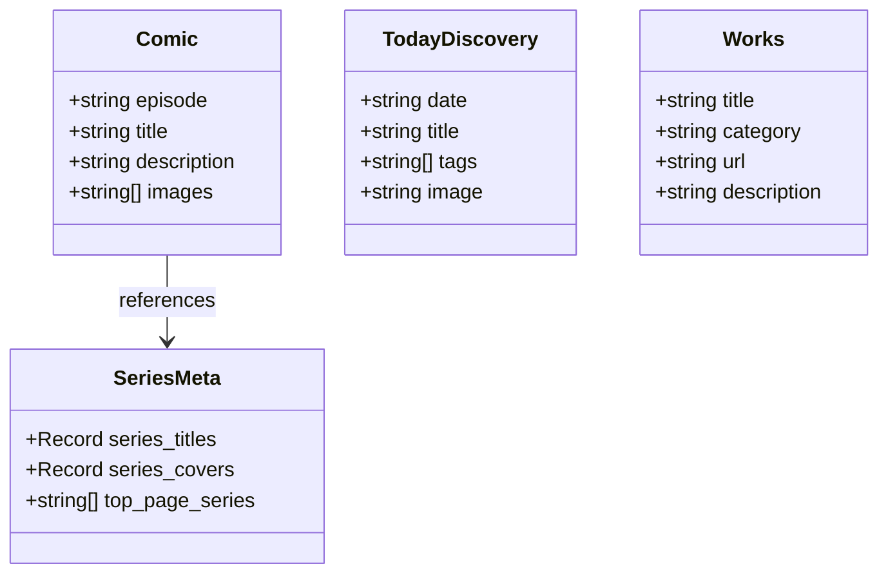

# Koleco

> **The creator's brain, made public.**
> One site. Every comic, discovery, game, and sound you make — collected and shown to the world.

[](https://astro.build/)
[](./LICENSE)
[](https://vitest.dev/)
[](https://pages.cloudflare.com/)

🌐 **Live:** [studio.meowtoon.com](https://studio.meowtoon.com)

---

## What is Koleco?

**Koleco** (Esperanto: *kolekto* — collection) is a static personal creator site.
Not a blog. Not a template. A living, growing **collection of everything one creator makes**.

Comics drawn every day. Discoveries shared every day. 3D games shipped over time. Sound albums recorded along the way. All in one place, under your own domain, with zero backend.

The premise is simple: **a creator's output is their brain made public.** Koleco is where that happens.

---

## Four content types. One creative base.



---

## Why static-first?

Most creator platforms own your content. Koleco does not.

| Property | What it means |
|---|---|
| Zero backend | Pure static HTML — no server, no database, no lock-in |
| Own your domain | Deploy to Cloudflare Pages, Vercel, or any CDN |
| Own your content | Markdown files in `src/content/` — plain text, forever readable |
| TDD-tested core | All utility functions in `src/lib/` tested with Vitest |
| MD3 design system | Material Design 3 tokens — consistent, themeable, yours |
| Snake_case throughout | `comic.js`, `today_discovery.js`, `series_meta.js` — zero ambiguity |

---

## A 30-second example

You write a comic episode:

```yaml
---
episode: "097"
title: "The Monday Cat"
description: "Monday arrives. Cat disagrees."
images:
  - /images/comic/everyday/097/01.png
  - /images/comic/everyday/097/02.png
  - /images/comic/everyday/097/03.png
  - /images/comic/everyday/097/04.png
---
```

Koleco builds a full episode page with swipe navigation, keyboard shortcuts, loading indicator, and adaptive MD3 navigation — automatically.

---

## Build flow



---

## Adaptive navigation

Koleco renders three navigation patterns from a single component — no JavaScript framework needed.



---

## Data model



---

## Tech stack

| Layer | Choice |
|---|---|
| Framework | [Astro v5](https://astro.build/) — static output, Content Layer API |
| Design | Material Design 3 — Rose Pink seed `#B5005B` |
| Icons | [Tabler Icons](https://tabler.io/icons) — webfont, npm |
| Testing | [Vitest](https://vitest.dev/) — TDD, pure function unit tests |
| Hosting | [Cloudflare Pages](https://pages.cloudflare.com/) — free tier |
| Content | Markdown — Astro Content Collections with Zod schema |
| Conventions | `snake_case`, JSDoc, single-responsibility, TDD Red-first |

---

## Project structure

```
src/
├── components/
│   ├── navigation.astro      # MD3 adaptive nav (mobile / tablet / desktop)
│   ├── episode_nav.astro     # Comic prev / list / next navigation
│   └── footer.astro          # Copyright footer
├── content/
│   ├── comic/                # {lang}/{series}/{episode}.md
│   ├── today_discovery/      # YYYY-MM-DD.md  (_archive/ excluded from build)
│   └── works/                # {category}/{slug}.md
├── layouts/
│   └── base_layout.astro     # OGP, GA4, font imports
├── lib/
│   ├── comic.js              # Episode helpers — all TDD-tested
│   ├── today_discovery.js    # Discovery helpers — all TDD-tested
│   ├── works.js              # Works helpers — all TDD-tested
│   ├── series_meta.js        # Series titles, covers, top-page order
│   └── fixtures/             # Synthetic test data (no Astro runtime needed)
└── pages/
    ├── index.astro            # Homepage
    ├── about.astro            # Creator profile + social links
    ├── 404.astro              # Custom 404
    ├── [lang]/comic/          # Comic reader pages
    ├── today/                 # Today's Discovery archive
    └── works/                 # Works listing
public/
└── css/
    ├── md3-tokens.css         # MD3 design tokens (colors, type, shape)
    └── style.css              # Global styles + responsive layout
docs/
├── develop_plan_v2.md         # 22-phase development plan + checklist
└── adr.md                     # Architecture Decision Records
```

---

## Getting started

### Prerequisites

- Node.js 20.x or later
- npm 10.x or later

### Install

```bash
git clone https://github.com/hiroxpepe/koleco.git
cd koleco
npm install
```

### Develop

```bash
npm run dev
```

Open `http://localhost:4321`.

### Test

```bash
npm run test
```

All tests run against pure utility functions in `src/lib/` — no browser, no Astro runtime needed.

### Build

```bash
npm run build
```

Outputs static HTML to `dist/`. Zero errors = ready to deploy.

---

## Content conventions

### Comic episode

File: `src/content/comic/{lang}/{series}/{episode}.md`

```yaml
---
episode: "001"
title: "Episode title"
description: "Optional one-line description"
images:
  - /images/comic/{series}/001/01.png
  - /images/comic/{series}/001/02.png
  - /images/comic/{series}/001/03.png
  - /images/comic/{series}/001/04.png
---
```

### Today's Discovery

File: `src/content/today_discovery/YYYY-MM-DD.md`

```yaml
---
date: "2026-05-22"
title: "Starlings fly as one"
tags: ["Nature"]
---

Body text — 1 to 3 sentences.
```

Archive old entries to `src/content/today_discovery/_archive/`.
The glob pattern `*.md` loads only root-level files — archived entries are never built.

### Works

File: `src/content/works/{category}/{slug}.md`

```yaml
---
title: "Game title"
category: "game"
url: "https://example.com"
description: "One-line description"
---
```

---

## Design system

Koleco uses **Material Design 3** with a custom Rose Pink seed color.

```
Seed color:  #B5005B
Primary:     #B5005B  (Rose Pink)
Secondary:   #74565F
Surface:     #FEF4F6
```

All tokens live in `public/css/md3-tokens.css`. To swap the theme:

1. Pick a new seed color at [m3.material.io/theme-builder](https://m3.material.io/theme-builder)
2. Replace token values in `public/css/md3-tokens.css`
3. Run `npm run build` to verify

Light mode only. Dark mode is intentionally deferred to v2.

---

## Forking this project

Koleco is a personal site, but the structure is designed to be reused. To make it yours:

1. Replace `src/content/` with your own Markdown
2. Update `src/lib/series_meta.js` — series titles, covers, top-page order
3. Edit `src/pages/about.astro` — your bio, social links, email
4. Update `public/css/md3-tokens.css` — your seed color
5. Edit `src/components/navigation.astro` — your nav items
6. Set `site` in `astro.config.mjs` to your domain
7. Connect to Cloudflare Pages and push to deploy

---

## License

[MIT](./LICENSE) © hiroxpepe
