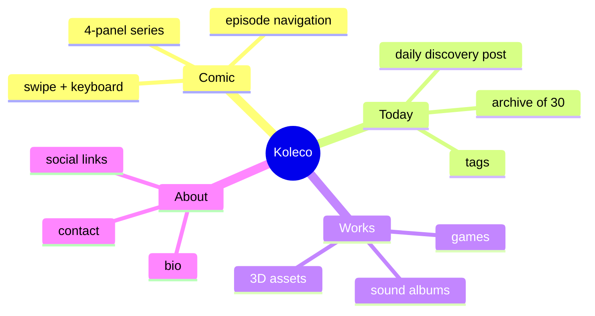
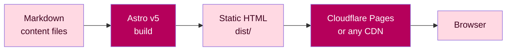
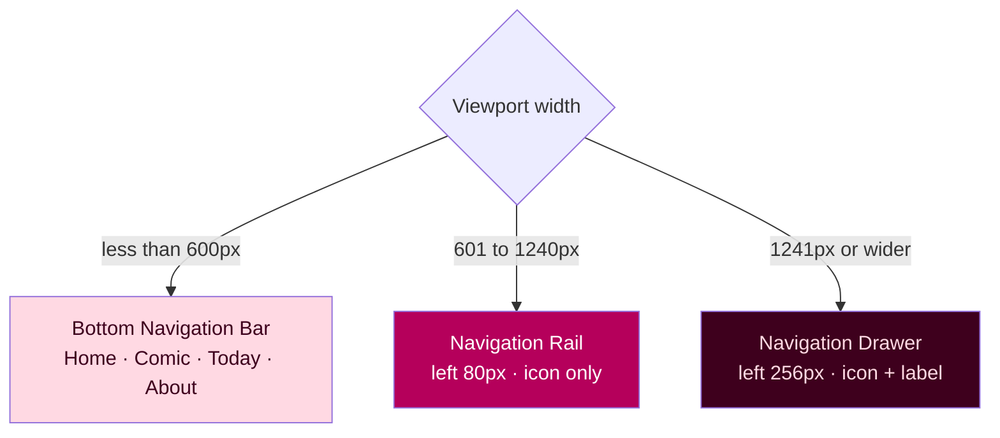
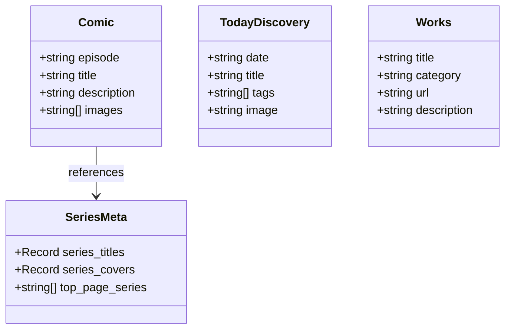

# Koleco

> **The creator's brain, in public.**
> One site. Every comic, daily note, game, and sound you make — all kept and shown to the world.

[](https://astro.build/)
[](./LICENSE)
[](https://vitest.dev/)
[](https://pages.cloudflare.com/)

🌐 **Live:** [studio.meowtoon.com](https://studio.meowtoon.com)

---

## What is Koleco?

**Koleco** (Esperanto: *kolekto* — collection) is a static personal site for one creator.
It is not a blog. It is not a template. It is one place where one creator keeps
**everything they make**, and the place keeps growing as they keep making things.

Comics drawn each day. Daily notes shared each day. 3D games shipped over time.
Sound albums recorded along the way. All in one site, under your own domain,
with no backend.

The idea is simple: **what a creator makes is their mind, in public.**
Koleco is where that happens.

---

## Four kinds of content. One creative base.



---

## Why static-first?

Most creator platforms keep your content inside their system. Koleco does not.

| Property | What it means |
|---|---|
| Zero backend | Static HTML only — no server, no database, no lock-in |
| Your own domain | Deploy to Cloudflare Pages, Vercel, or any CDN |
| Your own content | Markdown files in `src/content/` — plain text, easy to read forever |
| TDD-tested core | All helper functions in `src/lib/` are tested with Vitest |
| MD3 design system | Material Design 3 tokens — same look across pages, easy to re-theme |
| `snake_case` everywhere | `comic.js`, `today_discovery.js`, `series_meta.js` — clear names |

---

## A 30-second example

You write one comic episode:

```yaml
---
episode: "097"
title: "The Monday Cat"
description: "Monday arrives. Cat disagrees."
images:
  - /images/comic/everyday/097/01.png
  - /images/comic/everyday/097/02.png
  - /images/comic/everyday/097/03.png
  - /images/comic/everyday/097/04.png
---
```

Koleco builds the full episode page for you — with swipe navigation, keyboard
shortcuts, a loading indicator, and adaptive MD3 navigation.

---

## Build flow



---

## Adaptive navigation

One component shows three navigation patterns based on screen width.
No extra JavaScript framework is needed.



---

## Data model



---

## Tech stack

| Layer | Choice |
|---|---|
| Framework | [Astro v5](https://astro.build/) — static output, Content Layer API |
| Design | Material Design 3 — Rose Pink seed `#B5005B` |
| Icons | [Tabler Icons](https://tabler.io/icons) — webfont, from npm |
| Testing | [Vitest](https://vitest.dev/) — TDD, unit tests on pure functions |
| Hosting | [Cloudflare Pages](https://pages.cloudflare.com/) — free tier |
| Content | Markdown — Astro Content Collections with Zod schema |
| Conventions | `snake_case`, JSDoc, single-responsibility, TDD Red-first |

---

## Project structure

```
src/
├── components/
│   ├── navigation.astro      # MD3 adaptive nav (mobile / tablet / desktop)
│   ├── episode_nav.astro     # Comic prev / list / next navigation
│   └── footer.astro          # Copyright footer
├── content/
│   ├── comic/                # {lang}/{series}/{episode}.md
│   ├── today_discovery/      # YYYY-MM-DD.md  (_archive/ is not built)
│   └── works/                # {category}/{slug}.md
├── layouts/
│   └── base_layout.astro     # OGP, GA4, font imports
├── lib/
│   ├── comic.js              # Episode helpers — TDD-tested
│   ├── today_discovery.js    # Discovery helpers — TDD-tested
│   ├── works.js              # Works helpers — TDD-tested
│   ├── series_meta.js        # Series titles, covers, home-page order
│   └── fixtures/             # Fake test data (no Astro runtime needed)
└── pages/
    ├── index.astro            # Home page
    ├── about.astro            # Creator profile + social links
    ├── 404.astro              # Custom 404
    ├── [lang]/comic/          # Comic reader pages
    ├── today/                 # Today's Discovery archive
    └── works/                 # Works listing
public/
└── css/
    ├── md3-tokens.css         # MD3 design tokens (colors, type, shape)
    └── style.css              # Global styles + responsive layout
docs/
├── develop_plan_v2.md         # 22-phase development plan + checklist
└── adr.md                     # Architecture Decision Records
```

---

## Getting started

### What you need

- Node.js 20.x or newer
- npm 10.x or newer

### Install

```bash
git clone https://github.com/hiroxpepe/koleco.git
cd koleco
npm install
```

### Run in dev mode

```bash
npm run dev
```

Open `http://localhost:4321`.

### Run the tests

```bash
npm run test
```

All tests run against pure helper functions in `src/lib/` — no browser, no
Astro runtime needed.

### Build for production

```bash
npm run build
```

Static HTML is written to `dist/`. If there are no errors, it is ready to deploy.

---

## How to write content

### Comic episode

File: `src/content/comic/{lang}/{series}/{episode}.md`

```yaml
---
episode: "001"
title: "Episode title"
description: "Optional one-line description"
images:
  - /images/comic/{series}/001/01.png
  - /images/comic/{series}/001/02.png
  - /images/comic/{series}/001/03.png
  - /images/comic/{series}/001/04.png
---
```

### Today's Discovery

File: `src/content/today_discovery/YYYY-MM-DD.md`

```yaml
---
date: "2026-05-22"
title: "Starlings fly as one"
tags: ["Nature"]
---

Body text — 1 to 3 short sentences.
```

To hide old entries, move them to `src/content/today_discovery/_archive/`.
The `*.md` glob loads only top-level files, so anything inside `_archive/` is
never built.

### Works

File: `src/content/works/{category}/{slug}.md`

```yaml
---
title: "Game title"
category: "game"
url: "https://example.com"
description: "One-line description"
---
```

---

## Design system

Koleco uses **Material Design 3** with a Rose Pink seed color.

```
Seed color:  #B5005B
Primary:     #B5005B  (Rose Pink)
Secondary:   #74565F
Surface:     #FEF4F6
```

All tokens live in `public/css/md3-tokens.css`. To change the theme:

1. Pick a new seed color at [m3.material.io/theme-builder](https://m3.material.io/theme-builder)
2. Paste the new token values into `public/css/md3-tokens.css`
3. Run `npm run build` to check that it still builds

Light mode only. Dark mode is on hold for v2.

---

## How to make this site your own

Koleco is one creator's site, but the layout is made to be reused. To turn it
into your own site:

1. **Edit `src/config/site.js`** — your site name, creator profile, bio, social handles, and contact email
2. **Copy `.env.example` to `.env`** and set `PUBLIC_SITE_URL` to your real domain (and `PUBLIC_GA4_ID` if you want Google Analytics 4)
3. **Replace `src/content/`** with your own Markdown — comics, today_discovery entries, and works
4. **Edit `src/lib/series_meta.js`** — your series titles, cover images, and the order they appear on the home page
5. **Edit `public/css/md3-tokens.css`** — your own seed color, if you want a different theme
6. **Edit `src/components/navigation.astro`** — your own nav items, if the defaults do not fit
7. **Edit `src/content/privacy/`** — replace the sample `germio.md` with one Markdown file per app you want to host a Privacy Policy for, then give `/privacy/{slug}/` to the app store. See `docs/privacy_policy_design.md` for the full schema and the reasons behind it
8. **Edit `package.json`** — change `name` to your repository name
9. **Connect to Cloudflare Pages and push** to deploy

---

## License

[MIT](./LICENSE) © hiroxpepe
